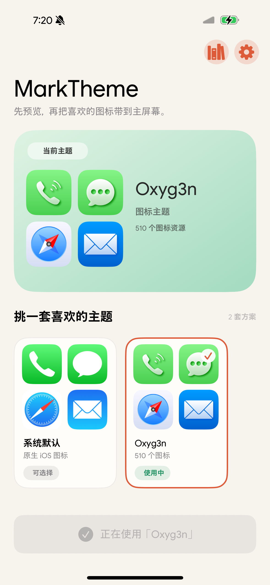
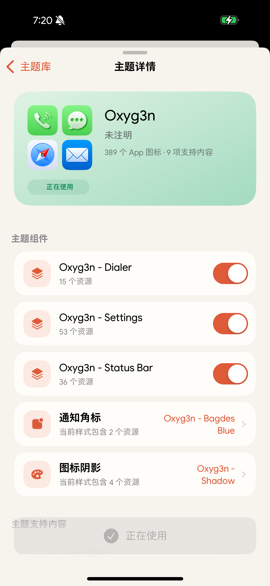

# MarkTheme64e

MarkTheme64e 是面向现代 iOS 越狱环境的模块化主题引擎与管理器，支持 conventional rootless 与
RootHide。它在兼容主流主题资产（SnowBoard / IconBundles 风格的 `.theme` 包）的前提下，把
主题的解析与编译全部放在无注入的管理器 App 内完成，注入进程中只运行一个尽可能小的 Runtime，
并始终以「回到系统原生外观」作为失败时的正确结果。

当前版本为 `v0.1.8-64e`。两种越狱环境使用不同软件包，请勿混装。

## 截图

<p align="center">
  
  
</p>

## 功能

- 导入 ZIP、DEB、TAR 系归档或已展开的目录，在保存前完整审阅识别结果
- 严格校验主题资产：两遍 ZIP 解码审计、静态 PNG 结构与全像素校验、限额 plist 读取
- 每次导入生成可恢复的 Library revision，支持崩溃残留恢复与原子切换
- 编译产物以 root-owned 不可变 generation 发布，Runtime 只读访问
- 主题化 SpringBoard 桌面图标、文件夹、角标、Spotlight、设置、电话、照片分享页与系统分享页图标
- 支持作者自定义遮罩，或复用系统原生圆角遮罩
- 应用与回滚都不修改系统视图层级，仅替换图像内容
- 支持简体中文与英文

## 兼容性

| Package scheme | 适用环境 | `.deb` Architecture |
| --- | --- | --- |
| `rootless` | conventional rootless（如 Dopamine） | `iphoneos-arm64` |
| `roothide` | RootHide（如 Relaxin） | `iphoneos-arm64e` |

- 最低系统 iOS 16.0；App、Helper 与 Runtime 均包含 `arm64` 与 `arm64e` slices。
- 不支持 rootful，也不支持在两种 package scheme 之间混装。
- 软件包依赖 `uikittools` 与 `ellekit (>= 1.2)`。

Runtime 当前适配的系统进程：SpringBoard、Spotlight、Preferences、Photos、MobilePhone、
SharingUIService、UIKit ShareUI 与 sharingd。iOS 16 与 iOS 17 的分享图标入口按实际宿主分别
覆盖，ShareSheet Activity、SharingUI provider 与 UIKit App icon 生产入口可独立、延迟安装。
每个进程先按 `bundle id + 可执行文件名` 匹配对应模块，再由适配器
在运行时逐项校验目标类、实现镜像路径、selector、方法签名，以及必要时的 ivar 类型与偏移；
校验通过才安装 Hook。

> 适配层不使用系统 build 或 Mach-O UUID 白名单推断兼容性。任何一项实时 ABI 校验不通过时，
> 对应表面保持系统原生外观，不会猜测调用私有接口。少数依赖对象布局的表面（如角标背景）
> 额外钉定 ivar 偏移，因此在布局变化的系统版本上会静默回退到原生外观而不是崩溃。
> 当前 ABI 维护基线包含 iOS 16.2 / RootHide 用户诊断、iOS 16.4 Simulator runtime，
> 以及 iOS 17.3.1 / RootHide 实机；
> 其他系统小版本与 conventional rootless 组合仍需实机验证。

## 安装与安全

从 Releases 下载与当前越狱环境匹配的软件包，用你惯用的包管理器安装，或：

```bash
dpkg -i com.hmmzzz.marktheme64e_<version>_<arch>.deb
```

安装后在桌面打开 MarkTheme64e，导入主题包并应用。切换主题后需要一次 Respring 才能让新的
Runtime 映像生效；App 会在应用完成后提示。

主题资产不完整或与系统不兼容可能影响桌面显示。安装和切换前，请确认能够进入当前越狱的
safe mode 并通过软件包管理器移除 MarkTheme64e。不要手动修改 MarkTheme64e 的 Runtime Store 或
Library 数据。

## 实现边界

- 注入进程中只允许运行 Runtime；解析、编译与 IO 全部在管理器 App 侧完成。
- 产品包只含管理器 App、一个短生命周期的 root Helper 和一个 Runtime，无 daemon、无 IPC
  热路径、无轮询。
- 适配器只替换图像内容，不新增、删除或重排 view / layer。
- 任何身份、ABI、尺寸或资源校验失败都返回系统原始结果，绝不猜测。

## 构建

需要 macOS/Xcode、[RootHide Theos](https://github.com/roothide/theos)、兼容的 iOS SDK、
`ldid` 与 `rg`。

```bash
git clone https://github.com/Hmmzzz/MarkTheme64e.git
cd MarkTheme64e
export THEOS=/path/to/roothide-theos

make package-roothide
make package-rootless
# 或依次构建两种软件包
make package-all
```

生成的 `.deb` 位于 `packages/`；上述目标会自动调用 `scripts/verify-package` 检查 scheme
布局、Mach-O slices、最低系统版本、linking、entitlements、文件权限与 Runtime 进程白名单。
也可以单独审计已有软件包：

```bash
./scripts/verify-package packages/<marktheme64e.deb>
```

## 测试

```bash
./tests/run
```

测试只在宿主机编译和运行，不会连接设备、部署软件包、应用主题、Respring 或 reboot。

## 目录结构

| 路径 | 内容 |
| --- | --- |
| `app/` | UIKit 管理器 App 与本地化资源 |
| `core/` | 跨层共享的基础类型与工具 |
| `ingestion/`、`importers/` | 归档校验、ZIP 解码审计与主题元数据解析 |
| `compiler/`、`library/` | Generation 编译与 Library revision 管理 |
| `workflow/` | 导入流程状态机与协调 |
| `store/`、`helper/` | Runtime Store 与受限 root helper |
| `runtime/`、`modules/` | 注入映像、进程适配器与主题资源模块 |
| `platform/` | 越狱环境路径解析（rootless / RootHide） |
| `layout/` | Debian package lifecycle |
| `scripts/`、`tests/` | 双包构建审计与宿主回归 |

## 参与贡献

欢迎提交 issue 和 pull request。功能改动请运行宿主回归；涉及路径、权限、package lifecycle
或 scheme 的改动还应分别构建并审计 rootless 与 RootHide 软件包。请勿提交 `.theos/`、
`packages/`、`.deb`、设备数据、密钥或其他本机产物。

## 致谢

- [SnowBoard](https://sparkdev.me/)：主题资产格式与 IconBundles 生态的事实标准，
  MarkTheme64e 的资产兼容性以其为基础
- [RootHide](https://github.com/roothide/Developer)：RootHide 架构与兼容基础
- [Theos](https://theos.dev/)：iOS 越狱开发与打包工具链
- [ElleKit](https://github.com/evelyneee/ellekit)：Runtime 使用的方法替换实现

第三方许可见 [`THIRD_PARTY_NOTICES.md`](THIRD_PARTY_NOTICES.md)。

## 主题许可与免责声明

MarkTheme64e 不提供、销售、授权、审核或分发任何第三方主题或图标资产。用户应自行确认拥有导入、
使用、复制或分发相关资产所需的权利；本项目的 GPL 许可不授予任何第三方资产权利。

本软件按“现状”提供，不作任何担保。项目维护者与贡献者不对未经授权使用主题资产，或兼容性、
不当操作造成的设备异常、数据丢失和系统不稳定负责；完整条款见 GPLv3 第 15、16 条。

本项目与 Apple Inc. 无关，亦不隶属于任何主题作者或既有主题引擎。

## 许可证

Copyright (C) 2026 Hmmzzz.

Licensed under the [GNU General Public License v3.0 only](LICENSE).
